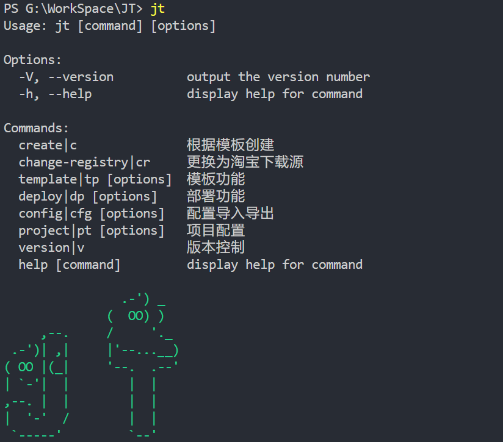
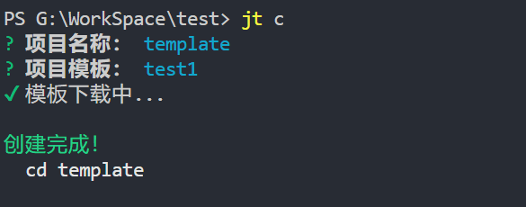
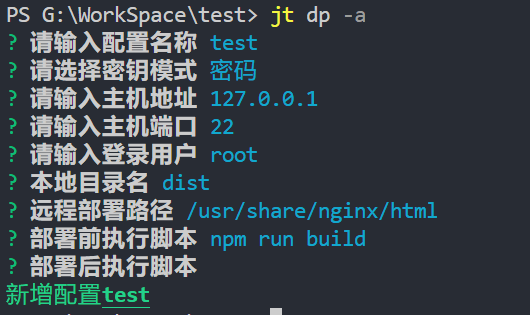
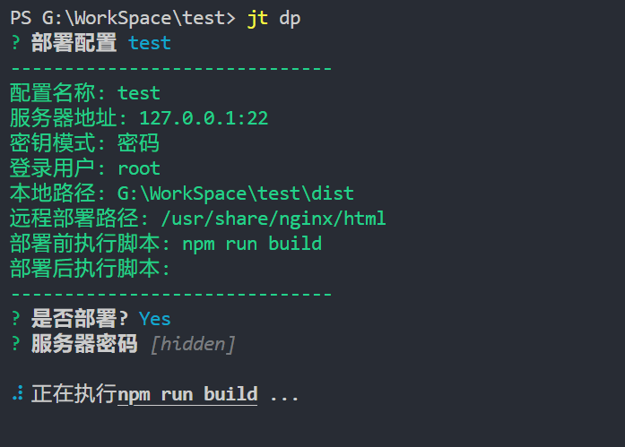
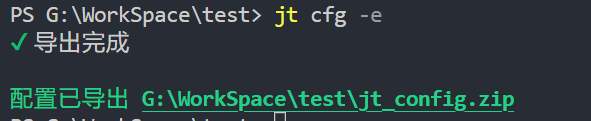
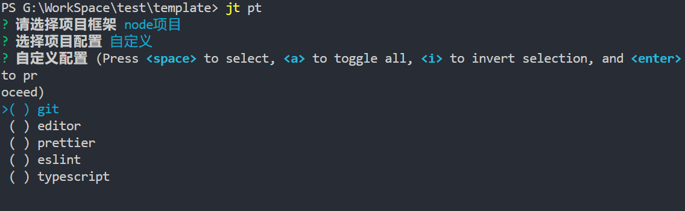
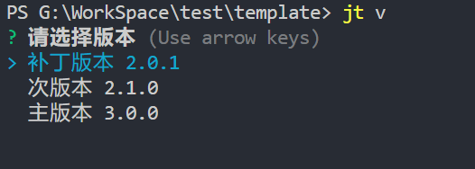

# jt工具命令
在开发/工作中，常常碰到一系列需要自动化的工作，本命令提供了一系列本人常用的命令行工具

## 1、安装
```sh
npm i -g jtcommand
```
## 2、使用
命令行直接输入 `jt` 即可使用
```sh
jt -h
```
所有命令均支持 `-h` 查看详情
## 3.命令说明
### 1、jt create|c
基于已有的模板创建项目(功能类似于 [degit](https://github.com/Rich-Harris/degit))，第一次使用需要先用 `jt template -a` 新建模板
```sh
jt c
```

### 2、jt change-registry|cr
本命令提供了快速切换源的功能，对于国内的开发者来说，npm官方源的下载速度不太给力，可以切换为淘宝源，也支持切换回官方源，目前支持 `npm`、`yarn`、`pnpm` 包管理器
```sh
jt cr
```


### 3、jt template|tp
提供模板功能,支持对模板的增删改，主要用于 `jt c` 创建基于模板的项目。支持本地文件路径、github clone路径。
```sh
jt tp -a
```


其他参数可使用 `-h` 查看
### 4、jt deploy|dp
自动部署前端项目的命令，避免每次都需要手动登录服务器的繁琐操作。

**首次使用需要先用 `jt dp -a` 新增一个配置**
```sh
jt dp -a
```

注意：目前暂未实现密钥模式；

本地目录名：指build出来的文件夹，一般是 `dist`;

部署前脚本：在执行自动部署流程之前的操作(`jt dp` 命令不会自动执行 `npm run build`);

部署后脚本：在执行自动部署流程之后的操作

**初始化配置后即可开始部署**
```sh
jt dp
```

确认需要部署的配置，输入密码后，则开始进行自动部署

问题解答1：本命令不会保存密码在本地文件中，而是由用户手工输入，保证密码的安全性

问题解答2：如果出现部署路径的权限问题，请先保证当前的登录用户拥有服务器部署路径的写入权限

其他参数可使用 `-h` 查看
### 5、jt config|cfg
提供配置导入/导出的功能，用于和其他人分享配置
```sh
jt cfg -e
```


其他参数可使用 `-h` 查看

### 6、jt project|pt
当初始化一个项目之后，为了能够遵循统一的代码规范，可能需要配置大量的eslint、prettier以及提交格式校验等，为了避免重复的劳动力，该命令实现了自动增加规范化配置文件，使得新增的项目可以保持相同的代码规范
```sh
jt pt
```

执行完成后，会发现项目中新增了许多配置文件以及  `package.json` 新增了几个包

其他参数可使用 `-h` 查看
### 7、jt version|v
提供更新 `package.json` 的 `version` 版本的功能，避免每次更新版本都得手动修改。
```sh
jt v
```

